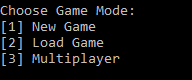
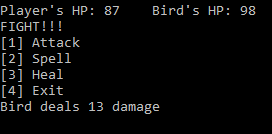

Simple terminal RPG game.
The main goal of this project is to clear out the concet of OOP. It performs simple tasks with files that contain using json files in which player can store a save.
It also uses SQLite database to store stats of items which player can buy in shop.

Main menu screen:

Fight screen:

